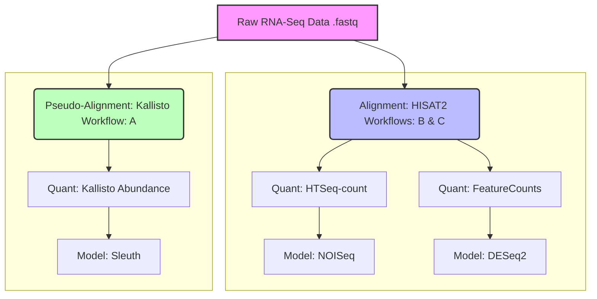

# Comparative Analysis of RNA-Seq Quantification Pipelines
**Benchmarking alignment-based vs. alignment-free methods for differential gene expression.**

## 📌 Project Overview
This project evaluates three distinct computational workflows for analyzing RNA-sequencing data. The goal was to compare **computational efficiency** (memory/speed) and **statistical concordance** (overlap of differentially expressed genes) across different algorithms.

The dataset consists of paired-end RNA-Seq libraries derived from primary hepatocytes of *Mus musculus* incubated at two temperature conditions (**34 °C vs. 38 °C**) and treated with DMSO. The experimental design enables controlled evaluation of differential gene expression under temperature-induced stress.

This chart illustrates the three pipelines benchmarked in the project:

---
## 🔬 Methodology
Three workflows were implemented starting from raw FASTQ files:
<table style="width:100%">
  <thead>
    <tr>
      <th>Component</th>
      <th>Workflow A</th>
      <th>Workflow B</th>
      <th>Workflow C</th>
    </tr>
  </thead>
  <tbody>
    <tr>
      <td><b>Alignment</b></td>
      <td colspan="2" align="center">Alignment-based (HISAT2)</td> 
      <td>Kallisto (Pseudo-alignment)</td>
    </tr>
    <tr>
      <td><b>Quantification</b></td>
      <td>HTSeq-count</td>
      <td>FeatureCounts</td>
      <td>Kallisto</td>
    </tr>
    <tr>
      <td><b>Normalization</b></td>
      <td>TMM</td>
      <td>Internal</td>
      <td>Internal</td>
    </tr>
    <tr>
      <td><b>DGE Model</b></td>
      <td>NOISeq (Non-parametric)</td>
      <td>DESeq2 (Parametric)</td>
      <td>Sleuth (Parametric)</td>
    </tr>
  </tbody>
</table>

***
## 📊 Results

### 1. Computational Performance
We benchmarked the resource consumption of the mapping and quantification steps:

| Metric | Workflow A/B (HISAT2) | Workflow C (Kallisto) |
| :--- | :--- | :--- |
| **Speed** | Slower (Baseline) | **~4-5x faster** |
| **Memory (Runtime)** | 6 GB | **3.6 GB** |
| **Memory (Index Build)** | Up to 160 GB | Low (Depends on Transcriptome Size) |

* **Conclusion:** The pseudo-alignment method (Kallisto) offers significantly reduced computational overhead, making it ideal for processing large datasets quickly on machines with limited RAM.

### 2. Differential Expression Analysis (DGE) Concordance

We compared the number of Differentially Expressed Genes (DEGs) identified by each tool using standard thresholds (DESeq2/Sleuth: adjusted p-value < 0.05; NOISeq: Prob > 0.7).

| Method | Total DEGs Found | Characteristics |
| :--- | :--- | :--- |
| **DESeq2** | **~3,593** | Highest sensitivity; detects the most candidates. |
| **Sleuth** | **~2,824** | Moderate sensitivity; high overlap with DESeq2. |
| **NOISeq** | **~1,237** | Lowest count, **highest specificity**; most conservative. |

* **Overlap:** A strong consensus was observed. There was a **94% overlap** between the genes found by the non-parametric NOISeq and the larger set found by DESeq2, validating the high specificity of NOISeq. The higher overlap between Sleuth and DESeq2 is expected, as both employ parametric models. 

### 3. Biological Validation

The biological relevance of the detected expression changes was confirmed by examining known temperature-responsive genes:

* **Target Genes:** *Cirbp* and *Hnrnph3* (known cold-shock RNA-binding proteins).
* **Outcome:** All three pipelines successfully detected the expected differential expression patterns for these key markers, confirming the validity of the technical results against known biology.

### 4. Selected Visualization

 #### I. Read assignment summary generated by MultiQC.

The plot below shows the distribution of read assignment categories generated by HTSeq and summarized using MultiQC.

#### II. Principal Component Analysis (PCA)

The PCA plot shows the variance-stabilized expression profiles of all
samples. Samples cluster according to incubation temperature, indicating
a clear transcriptional shift between the 34°C and 38°C conditions.

 #### III. Volcano Plot

The volcano plot visualizes the magnitude and significance of differential
gene expression between 34°C and 38°C. Significance was determined using:

- **Adjusted p-value (Benjamini–Hochberg):** *padj* < 0.05  
- **Log2 fold-change threshold:** applied to highlight biologically
meaningful changes

Upregulated genes are shown in **red**, downregulated genes in **blue**

 #### IV. Venn Diagram of Differentially Expressed Genes (DEGs)

The Venn diagram shows the overlap of significantly differentially expressed
genes detected by the three pipelines:

---

## 📝 Conclusion

The choice of RNA-Seq pipeline is highly dependent on the project goal and available resources:

* **For Discovery:** **DESeq2** is recommended when the goal is maximum sensitivity and identifying the largest set of potential candidates.
* **For Speed & Low Resources:** **Kallisto + Sleuth** is the most computationally efficient pipeline, providing highly concordant results with alignment-based methods at a fraction of the time.
* **For High Confidence & Low Replicates:** **NOISeq** is a non-parametric choice that yields a smaller, highly specific set of DEGs, useful for initial screening or experiments with limited biological replication.

***

## 💾 Data and Code

* **Organism:** *Mus musculus* (House Mouse)
* **Conditions:** DMSO treated hepatocytes at 34°C vs 38°C
* **Accession Runs:** SRR12759173 - SRR12759181
  
* **Note:** The original R scripts used for this analysis were lost due to a hardware
incident that occurred after the completion of the internship (September 2021).
Reconstructed example scripts are included in this repository to demonstrate the
workflows that were applied during the project.

 ### Example Scripts

These scripts are minimal representations of the command-line and R analysis steps in the project.

#### Command-Line & Quality Control (Bash)
* [Alignment, Quantification, & MultiQC](./scripts/workflow_a_b_commands.sh): Demonstrates the use of **HISAT2** (Alignment), **FeatureCounts** (Quantification), and **MultiQC** (QC Aggregation) for the alignment-based workflows (A & B).

#### R Modeling Scripts (Statistical Analysis)
* [Workflow A: NOISeq DGE Analysis](./scripts/workflow_a_noiseq_example.r): Shows the core functions for the **non-parametric** NOISeq model.
* [Workflow B: DESeq2 DGE Analysis](./scripts/workflow_b_deseq2_example.r): Shows the core functions for the **parametric** DESeq2 model.
* [Workflow C: Sleuth DTE Analysis](./scripts/workflow_c_sleuth_example.r): Shows the core functions for the **pseudo-alignment** (Kallisto) and **parametric** Sleuth model.

#### R Visualization Script
* [Volcano Plot Visualization](./scripts/visualization_volcano_plot.R): Demonstrates the base R code logic used to generate the final Volcano Plots from the DESeq2 output, highlighting significant hits.

---

